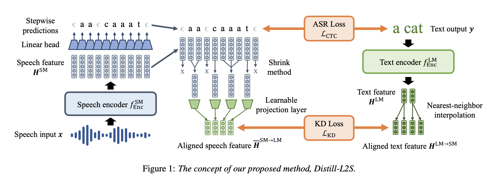

# Distilling a Pretrained Language Model to a Multilingual ASR Model

- Official implementation of the paper: https://arxiv.org/abs/2206.12638
- Accepted to Interspeech 2022.

## How to run experiments (Table 1)
**Environments**
- I used Python 3.8.12.
- Check [requirements.txt](./requirements.txt) for additional requirements.

**Supported datasets**
- Check [configs](config/dataset) for supported datasets.
- For example, if you want CommonVoice Czech, set `$dataset` as `common_voice_czech`.

**From scratch**
```bash
# If you change the # of GPUs, you have to fix per_device_train_batch_size in training config.
CUDA_VISIBLE_DEVICES=0,1 python3 train.py \
    +distill=random_init \
    +dataset=$dataset \
    +train=v1 \
    +xlsr=w2v2_xlsr
```
**Fine-tuning**
```bash
CUDA_VISIBLE_DEVICES=0,1 python3 train.py \
    +distill=vanilla \
    +dataset=$dataset \
    +train=v1 \
    +xlsr=w2v2_xlsr
```
**Fine-tuning + Distill-L2S**
```bash
# You have to set $lambda as the trade-off hyperparameter, i.e., 0.25, 0.5 or 1.0.
CUDA_VISIBLE_DEVICES=0,1 python3 train.py \
    +distill=shrink \
    +dataset=$dataset \
    +train=v1 \
    +xlsr=w2v2_xlsr \
    distill.feat_loss=$lambda
```
